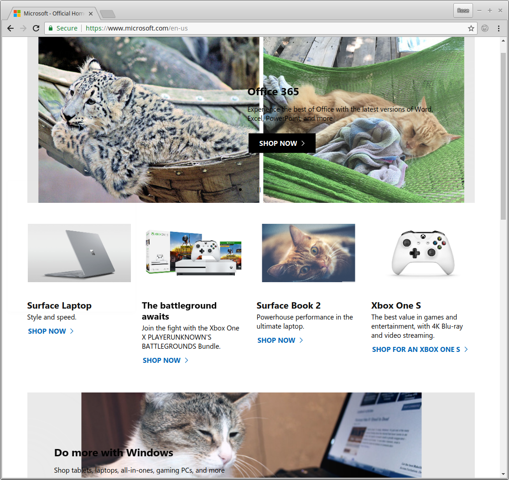
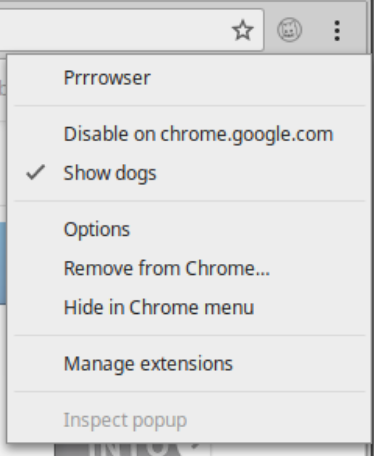

## Prrrowser

Browser extension for Chrome and Firefox that replaces images with similar images,
except with cats.

* Only replaces images that have some metadata available (ex. alt-text)
* Easy to disable on any site
* Option available to show dogs instead of cats
* Caches recent images for faster loading times

### Install on Chrome or Firefox
* Install Prrrowser from the [Chrome Web Store](https://chrome.google.com/webstore/detail/prrrowser/mekoagokpajkplmhfhomcmngphdjobem)
* Install the [Firefox Add-on](https://addons.mozilla.org/en-US/firefox/addon/prrrowser/)

## Settings
Right-click the Prrowser icon to open the menu.
* 'Show dogs' will toggle on for dogs, off for cats (default is cats)
* 'Disable on this site' to easily disable Prrrowser on any site
* 'Options' -> 'Low resolution images' (Chrome only)
* 'Options' -> 'Allow in incognito' (Chrome only - Firefox extensions work in 
   Private Browsing by default)

### Notes
Prrowser uses the `alt-text` or `title` of an image and searches Google Images for
'that string' + ' cats'. The first result is then resized and placed where the
old image was. If no metadata is provided, the image will not be altered.